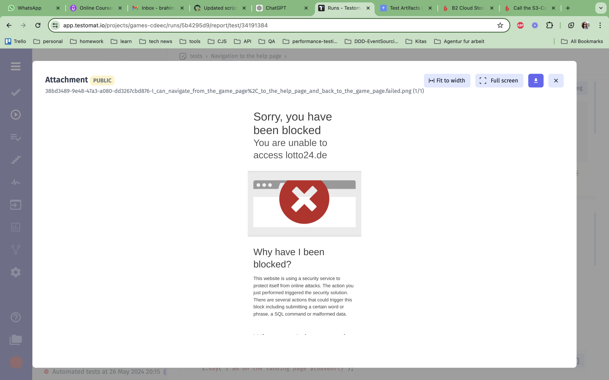

# CodeceptJS Project with Playwright

This project uses CodeceptJS and Playwright for test automation. It includes a GitHub workflow that runs tests periodically every hour and after pushing to the `main` branch.

## Introduction

This project leverages the power of CodeceptJS and Playwright to automate end-to-end testing. CodeceptJS provides a high-level API to write tests in a simple and readable manner, while Playwright ensures cross-browser compatibility and reliable test execution.

## Getting Started

To get started with this project, follow the instructions below.

### Installation

Requirements: node version minimum 18

First, run the command below to ensure you are using the necessary node version:

```bash
nmv use
```

Then, clone the repository and navigate to the project directory:

```bash
git clone git@github.com:brahimiarlinda/game-test.git
cd game-test
```

Then, install the project dependencies using npm:
```bash
npm install
```

To run the tests, use the following command:
```bash
npm test
```

### Reporting

The test results are shown in
1. [GitHub actions](https://github.com/brahimiarlinda/game-test/actions/workflows/run-tests.yml)
2. [Testomat](https://app.testomat.io/projects/games-cdeec/runs) where you can ask for permissions

## Todo

1. Create environmental variables for the secrets
2. Currently, the tests fail in the pipeline because of security reasons
 
